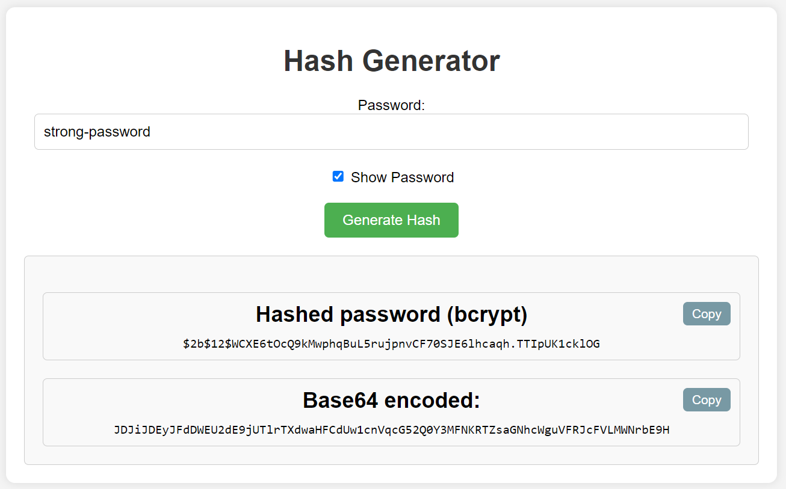

# About

[](https://hub.docker.com/r/fouriermourier/kf-dex-hash-gen)

This is a simple web application designed to generate hashed passwords 
for use in the `dex` configmap within the `auth` namespace in your kubernetes cluster. 
The hashed passwords can be used directly as bcrypt-encrypted values 
under the field `hash` in the configmap (not recommended), 
or as their base64-encoded equivalents stored as environment variables 
which should be used under the `hashFromEnv` key - 
denoted as the `DEX_USER_PASSWORD_BASE64_ENCODED` in the example below

```yaml
data:
  config.yaml: |
    issuer: ...
    storage: ...
    ...
    oauth2:
      skipApprovalScreen: true
    enablePasswordDB: true
    staticPasswords:
    - email: <your-email>
      hashFromEnv: DEX_USER_PASSWORD_BASE64_ENCODED
      username: <your username>
```

Secrets you have to update are located in the same `auth` namespace with the name `dex-passwords`:

```yaml
kind: Secret
apiVersion: v1
metadata:
  name: dex-passwords
  namespace: auth
  ...

...

data:
  DEX_USER_PASSWORD_BASE64_ENCODED: >-
    long-long-base64-encoded-bcrypt-encrypted-string

type: Opaque
```

Add your newly generated hash to the field `data`.  

And, since it's a configmap, you have to restart `dex` deployment when the changes are done 
for the changes to be applied.

# Usage

You can run it either as docker image or as py application.

## Preview
The page will look like this:



Copy `Base64 encoded` version to use in secrets or `Hashed password` 
to be inserted directly in the configmap

## Docker build

```shell
docker build -t kf-dex-hash-gen:alpine-v0 .
docker run -d -p 8000:8000 kf-dex-hash-gen:alpine-v0
```

## Python-app

```shell
cd "kf-dex-hash-gen"
pip install -r "requirements.txt"
python -m main.py
```